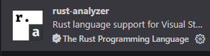

# 一、简单描述

其实所谓的 `rust` 安装，本质是安装 rust 的编译器 `rustc` ，以及对应的辅助管理 rust 的编译和测试的工具 `Cargo`, 而 `cargo` 可以 类比于 `python` 中的 `pip` ，以及 `nodejs` 项目中的 `npm` 


# 二、详细安装步骤

## 1. linux / MacOS 环境
其实网上的安装步骤很多，以下是我常用的简单的默认安装

主要下载和参考地址：
https://www.rust-lang.org/tools/install

其中，如果是 `linux/macOS` 环境，只需使用以上官网的以下命令默认安装即可：

```bash
# 在 MacOS 或者 Linux 环境进行安装
$ curl --proto '=https' --tlsv1.2 -sSf https://sh.rustup.rs | sh
```

## 2. windows 环境

对于在windows 环境中，可以使用以上官网 下载的 `rustup-init.exe` 进行默认安装也是可以的

另外，我是参考的 这篇 blog 进行的安装： https://course.rs/first-try/installation.html

主要是两步

### a. 安装前确认 已经安装了 `Microsoft C++ Build Tools`

由于我之前写 `c#` 时候需要安装 VStudio, 故而会提前安装好它， 如果没有安装，可以去微软官网，下载并安装： https://visualstudio.microsoft.com/zh-hans/visual-cpp-build-tools/


### b. 手动下载 `rustup-init.exe`

对于我个人来说，比较推荐在官网的这个地方下载这个软件的： https://www.rust-lang.org/learn/get-started

当下载完成后，双击，开始安装 它即可，但是我个人而言，还是比较推荐使用 `powershell` 来打开对应的 `rustup-init.exe` 软件，同时，当使用  `powershell` 打开和安装时，会看到以下信息，此时只需要输入 `1` 来进行默认安装即可：

```bash
# 一般推荐使用 powershell 进行打开和安装
C:\Users\Administrator> rustup-init.exe
......
Current installation options:

   default host triple: x86_64-pc-windows-msvc
     default toolchain: stable (default)
               profile: default
  modify PATH variable: yes

1) Proceed with installation (default)
2) Customize installation
3) Cancel installation

```

## 3. 测试安装是否成功

为了验证安装是否成功，可以使用以下命令进行查看

```bash

# 注意以下命令在 Windows / MacOs / Linux 中都是通用的
PS C:\Users\Administrator> rustc -V    # 确认 rust 的编译器 rustc 已经安装完毕
rustc 1.88.0 (6b00bc388 2025-06-23)
PS C:\Users\Administrator> cargo -V    # 确认辅助工具 cargo 已经安装完成
cargo 1.88.0 (873a06493 2025-05-10)
PS C:\Users\Administrator>


```

# 三、关于 rust 的升级和更新

其中对应 rust 版本的升级更新，很简单，只需要下面这行命令即可

```bash
#  更新 rust
$ rustup update

```

# 四、卸载 rust

关于 rust 卸载也特别简单，可以使用以下命令直接卸载即可，本质还是借助最初的 `rustup-init.exe` 工具，卸载 `rust` 的 编译器 `rustc` 和 开发辅助工具 `cargo` 而已

```bash
# 卸载 rust
$ rustup self uninstall

```


# 五、rust 开发中的一些好用的 工具和插件

其中，对于 rust 开发而言，不得不提的就是 使用 `vscode`, 而对于我个人而言，现在的开发主力基本都是使用 `VScode`, 而对于 VSCode 而言， 其不得不提的插件就是 `rust-analyzer`, 它能正确的进行 `rust` 语法检查，这极大的有助于在编译之前的 rust 代码的检查和书写



> 同时对于 `rust-analyzer`， 一般适用于在 `cargo` 项目下的代码分析，而如果是纯手动利用  `rustc` 编译和创建的项目，不能被识别，这是因为 缺少 `Cargo.toml`和`src/`文件, 而这两个文件会在，`cargo`创建的项目中自动生成，但是纯 `rustc` 编译和创建的项目，并不影响项目本身的编译和运行，故而看到以下 vscode 中的`rust-analyzer`报错提示，可以忽略，


> <font color='red'>2025-07-29T14:56:00.6301821+08:00 ERROR FetchWorkspaceError: rust-analyzer failed to fetch workspace</font>


> 另外，关于其他更多的插件，可以参考一下下面这几个blog，感觉很有用

1. https://www.duidaima.com/Group/Topic/Rust/18060
2. https://blog.csdn.net/happylzs2008/article/details/108108830


> 其中关于环境变量的配置，可以参考下面这篇：

3. https://zhuanlan.zhihu.com/p/655386777