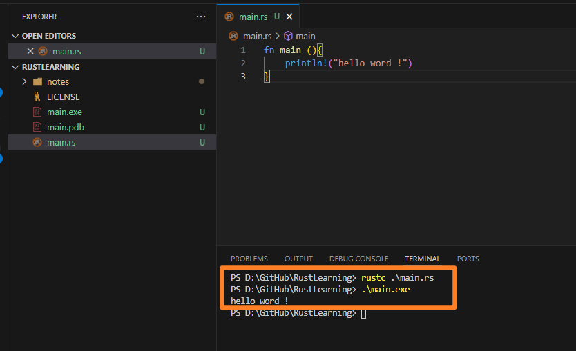
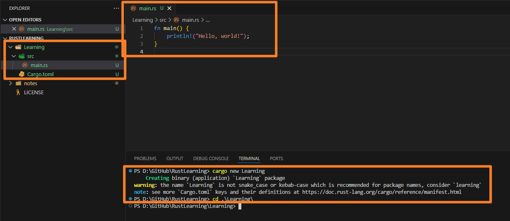
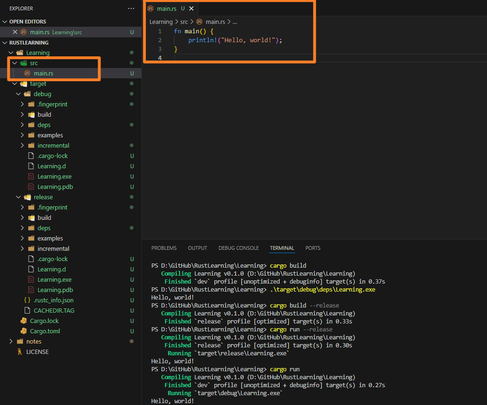

# 一、最基础的代码，以及对应编译方式


## 1. 手动编译

其实很简单，就是借助我们之前安装过的 `rustc` 编译我们创建的 `rust` 代码， 其中对于 rust 而言，非常像 其他的静态语言 比如 `c#` 其入口文件一般就是 `main.rs`


```rs
// 入口文件，同时 main 是入口函数
fn main (){
    println!("hello word !")
}
```

而对于以上代码，我们可以使用以下命令进行编译和运行

```bash
#  手动使用 rustc 编译rust的代码文件 main.rs ，使得其能够 生成可执行文件 main.exe 和 main.pdb 文件
$ rustc ./main.rs

# 运行以上生成的可执行文件 main.exe ，执行以上我们的代码打印
$./main.exe
hello word !


```

其中需要注意的是 `main.pdb` 文件是由编译器 `rustc` 在 `Windows` 上生成的 `Program Database` 文件。它包含调试信息，用于帮助调试器（如 `Visual Studio`、`GDB` 等）更好地调试程序。具体来说，这些信息包括：

- `符号信息`：如变量名、函数名等。
- `源代码位置`：将机器代码与源代码中的行号对应起来，使得调试器能显示源代码中的确切位置。
- `类型信息`：例如结构体、枚举等类型的详细描述。

> 通常，`.pdb` 文件用于在调试时提供更多信息。如果你不进行调试，通常可以忽略这个文件，因为它不会影响程序的运行，只会增加一些额外的体积。

> 你可以通过设置 `Rust` 编译选项来控制是否生成调试信息，通常使用 `cargo build --debug` 或 `cargo build --release` 来进行构建，这会决定是否生成 .pdb 文件。如果不需要调试信息，你可以在 `Cargo.toml` 中禁用调试信息生成。





## 2. 使用 `Cargo` 创建项目和编译 `rust` 项目文件

除了手动编译，一般而言，对于我们实际的开发中最常使用的是借助 `Cargo` 创建项目和编译 ,其中常用，以下命令

```bash
#  查看当前所有的可使用的命令行
$ cargo --help

# 创建新项目或者package名
$ cargon new <项目/包名>

# 打包当前项目

# 切换到指定项目根目录
$ cd <项目/包名>  

# 编译和打包当前项目，并生成对应的 可执行文件 exe 
# 其主要生成的文件为 Cargo.lock 和 target 文件夹，
# 其中 target 文件夹，主要包含当前项目编译所需的所有文件信息， 
# Cargo.lock 等价于 nodejs 的 package.lock 文件，用于标注和锁定当前项目的包和 rust 版本等信息 
# 其生成的文件在 ./target/debug/
$ cargo build    # 默认只生成 debug 版本，等价于 c# 项目中的 vstudio 的调试 debug 文件夹

$ cargo build --release  # 生成 release 版本，即增加了一个 /target/release/ 文件夹，这个文件夹里是真正的最终的优化打包，等价于 c# 项目中的 vstudio 的调试 release 文件夹

# 而最常用是 下面这行命令，它在 cargo build 的基础上，同时执行了打包完生成的 exe 文件
$ cargo run            #  执行的是 ./target/debug/Learning.exe 中生成的 exe文件， 因为默认不带参数是 debug 模式
$ cargo run --release  #  执行的是 ./target/release/Learning.exe 中生成的 exe文件， 此时指定生成的就是 release 文件夹和对应的文件

```

详情如下：

### a. 创建一个项目 `Learning`

其中项目的目录结构生成如下：

其中 src 就是我们在 `Rust` 项目中需要编辑的代码文件




### b. 打包和运行当前的项目

